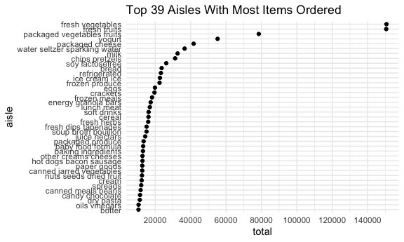
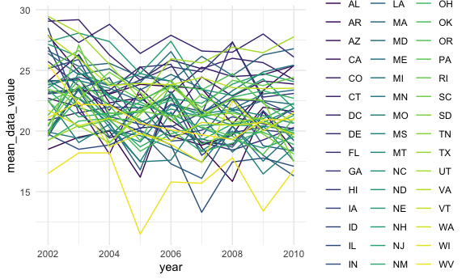
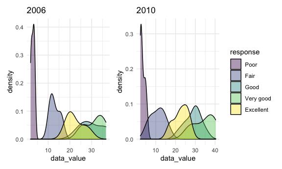
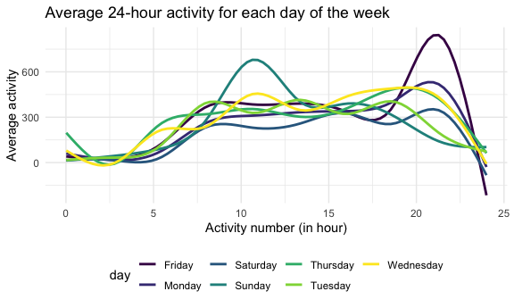

P8105 Homework 3
================

``` r
library(tidyverse)
```

    ## ── Attaching packages ─────────────────────────────────────── tidyverse 1.3.1 ──

    ## ✓ ggplot2 3.3.5     ✓ purrr   0.3.4
    ## ✓ tibble  3.1.4     ✓ dplyr   1.0.7
    ## ✓ tidyr   1.1.3     ✓ stringr 1.4.0
    ## ✓ readr   2.0.1     ✓ forcats 0.5.1

    ## ── Conflicts ────────────────────────────────────────── tidyverse_conflicts() ──
    ## x dplyr::filter() masks stats::filter()
    ## x dplyr::lag()    masks stats::lag()

``` r
library(p8105.datasets)
library(patchwork)

knitr::opts_chunk$set(
  fig.width = 6,
  fig.asp = .6,
  out.width = "90%"
)

theme_set(theme_minimal() + theme(legend.position = "bottom"))

options(
  ggplot2.continuous.colour = "viridis",
  ggplot2.continuous.fill = "viridis"
)

scale_colour_discrete = scale_colour_viridis_d
scale_fill_discrete = scale_fill_viridis_d
```

## Problem 1

``` r
data("instacart")
```

The “instacart” dataset contains 1384617 obsevations in total and each
row in the dataset represents a product from an order. There are 15
variables in this dataset. The order\_id variable is the order
identifier. The product\_id variable is the product identifier. The
add\_to cart\_order variable represents the order in which each product
was added to cart. The reordered variable is 1 if this prodcut has been
ordered by this user in the past and 0 otherwise. The user\_id variable
is the customer identifier. The eval\_set variable represents which
evaluation set this order belongs in. The order\_number variable is the
order sequence number for this user (1 = first, n = nth). The order\_dow
variable represents the day of the week on which the order was placed.
The order\_hour\_of\_day variable is the hour of the day on which the
order was placed. The days\_since\_prior\_order represents days since
the last order, capped at 30, NA if order\_number = 1. The product\_name
variable is the name of the product. The aisle\_id variable is the aisle
identifier. The department\_id variable is the department identifier.
The aisle variable represents the name of the aisle the product is in.
The department variable represents the name of the department the
product is in.

``` r
instacart %>%
  group_by(aisle) %>%
  summarize(total = n()) %>%
  arrange(desc(total))
```

    ## # A tibble: 134 × 2
    ##    aisle                          total
    ##    <chr>                          <int>
    ##  1 fresh vegetables              150609
    ##  2 fresh fruits                  150473
    ##  3 packaged vegetables fruits     78493
    ##  4 yogurt                         55240
    ##  5 packaged cheese                41699
    ##  6 water seltzer sparkling water  36617
    ##  7 milk                           32644
    ##  8 chips pretzels                 31269
    ##  9 soy lactosefree                26240
    ## 10 bread                          23635
    ## # … with 124 more rows

From the table above, we can see that there are 134 aisles and the top
10 aisles that most items are ordered from include fresh vegetables,
fresh fruits, packaged vegetable fruits, yogurt, packaged cheese, water
seltzer sparkling water, milk, chips pretzels, soy lactosefree, and
bread.

``` r
instacart %>%
  group_by(aisle) %>%
  summarize(total = n()) %>%
  arrange(desc(total)) %>%
  filter(total > 10000) %>%
  mutate(aisle = fct_reorder(aisle, total)) %>%
  ggplot(aes(x = total, y = aisle)) + geom_point() + labs(title = "Top 39 Aisles With Most Items Ordered", xlab = "Number of items", ylab = "Aisle") + scale_x_continuous(breaks = seq(from = 0, to = 160000, by = 20000))
```



The plot above shows the number of items ordered in each aisle.

``` r
instacart %>%
  filter(aisle %in% c("baking ingredients", "dog food care", "packaged vegetables fruits")) %>%
  group_by(aisle, product_name) %>%
  summarize(order_times = n()) %>%
  arrange(desc(order_times)) %>%
  mutate(rank = min_rank(desc(order_times))) %>%
  filter(rank <= 3) %>%
  knitr::kable()
```

    ## `summarise()` has grouped output by 'aisle'. You can override using the `.groups` argument.

| aisle                      | product\_name                                 | order\_times | rank |
|:---------------------------|:----------------------------------------------|-------------:|-----:|
| packaged vegetables fruits | Organic Baby Spinach                          |         9784 |    1 |
| packaged vegetables fruits | Organic Raspberries                           |         5546 |    2 |
| packaged vegetables fruits | Organic Blueberries                           |         4966 |    3 |
| baking ingredients         | Light Brown Sugar                             |          499 |    1 |
| baking ingredients         | Pure Baking Soda                              |          387 |    2 |
| baking ingredients         | Cane Sugar                                    |          336 |    3 |
| dog food care              | Snack Sticks Chicken & Rice Recipe Dog Treats |           30 |    1 |
| dog food care              | Organix Chicken & Brown Rice Recipe           |           28 |    2 |
| dog food care              | Small Dog Biscuits                            |           26 |    3 |

The table above shows the three most popular items in each of the aisles
“baking ingredients”, “dog food care”, and “packaged vegetables along
with the number of times ordered.

``` r
instacart %>%
  filter(product_name %in% c("Pink Lady Apples", "Coffee Ice Cream")) %>%
  group_by(product_name, order_dow) %>%
  summarize(mean_hour_day = mean(order_hour_of_day)) %>%
  pivot_wider(
    names_from = "order_dow",
    values_from = "mean_hour_day"
  ) %>%
  knitr::kable()
```

    ## `summarise()` has grouped output by 'product_name'. You can override using the `.groups` argument.

| product\_name    |        0 |        1 |        2 |        3 |        4 |        5 |        6 |
|:-----------------|---------:|---------:|---------:|---------:|---------:|---------:|---------:|
| Coffee Ice Cream | 13.77419 | 14.31579 | 15.38095 | 15.31818 | 15.21739 | 12.26316 | 13.83333 |
| Pink Lady Apples | 13.44118 | 11.36000 | 11.70213 | 14.25000 | 11.55172 | 12.78431 | 11.93750 |

The table above shows the mean hour of the day at which Pink Lady Apples
and Coffee Ice Cream are ordered on each day of the week (0 represents
the first day of the week).

## Problem 2

``` r
data("brfss_smart2010")
```

``` r
brfss_smart_cleaned = brfss_smart2010 %>%
  janitor::clean_names() %>%
  filter(topic == "Overall Health") %>%
  mutate(response = factor(response, c("Poor", "Fair", "Good", "Very good", "Excellent"))) %>%
  separate(locationdesc, into = c("state", "location"), sep = ' - ') %>%
  select(-locationabbr)
```

The above code chunk cleans the data by formatting the data to use
appropriate variable names, focusing on the “Overall Health” topic,
including only responses from “Excellent” to “Poor”, and organizing
responses as a factor taking levels ordered from “Poor” to “Excellent”.

``` r
brfss_smart_cleaned %>%
  filter(year == 2002) %>%
  group_by(state) %>%
  distinct(location) %>%
  summarize(times = n()) %>%
  filter(times >= 7) %>%
  arrange(times)
```

    ## # A tibble: 6 × 2
    ##   state times
    ##   <chr> <int>
    ## 1 CT        7
    ## 2 FL        7
    ## 3 NC        7
    ## 4 MA        8
    ## 5 NJ        8
    ## 6 PA       10

The result above showed that CT, FL, NC, MA, NJ, and PA were observed at
7 or more locations in 2002.

``` r
brfss_smart_cleaned %>%
  filter(year == 2010) %>%
  group_by(state) %>%
  distinct(location) %>%
  summarize(times = n()) %>%
  filter(times >= 7) %>%
  arrange(times)
```

    ## # A tibble: 14 × 2
    ##    state times
    ##    <chr> <int>
    ##  1 CO        7
    ##  2 PA        7
    ##  3 SC        7
    ##  4 OH        8
    ##  5 MA        9
    ##  6 NY        9
    ##  7 NE       10
    ##  8 WA       10
    ##  9 CA       12
    ## 10 MD       12
    ## 11 NC       12
    ## 12 TX       16
    ## 13 NJ       19
    ## 14 FL       41

The result above showed that CO, PA, SC, OH, MA, NY, NE, WA, CA, MD, NC,
TX, NJ, and FL were observed at 7 or more locations in 2010.

``` r
excellent_dataset = brfss_smart_cleaned %>%
  filter(response == "Excellent") %>%
  group_by(state, year) %>%
  summarize(mean_data_value = mean(data_value))
```

    ## `summarise()` has grouped output by 'state'. You can override using the `.groups` argument.

``` r
excellent_dataset
```

    ## # A tibble: 443 × 3
    ## # Groups:   state [51]
    ##    state  year mean_data_value
    ##    <chr> <int>           <dbl>
    ##  1 AK     2002            27.9
    ##  2 AK     2003            24.8
    ##  3 AK     2004            23.0
    ##  4 AK     2005            23.8
    ##  5 AK     2007            23.5
    ##  6 AK     2008            20.6
    ##  7 AK     2009            23.2
    ##  8 AL     2002            18.5
    ##  9 AL     2003            19.5
    ## 10 AL     2004            20  
    ## # … with 433 more rows

The dataset above is limited to Excellent responses, and contains year,
state, and a variable averages the data\_value across locations within a
state.

``` r
excellent_dataset %>%
  ggplot(aes(x = year, y = mean_data_value, color = state)) +
  geom_line(aes(group = state)) + theme(legend.position = "right")
```

    ## Warning: Removed 3 row(s) containing missing values (geom_path).



``` r
  labs(title = "Average data value of excellent responses across locations within a state",
       y = "Average data value wthin a state")
```

    ## $y
    ## [1] "Average data value wthin a state"
    ## 
    ## $title
    ## [1] "Average data value of excellent responses across locations within a state"
    ## 
    ## attr(,"class")
    ## [1] "labels"

The plot above shows a line of average value across locations for each
state over years.

``` r
NY_data_value_2006 = brfss_smart_cleaned %>%
  filter(year == 2006, state == "NY") %>%
  ggplot(aes(x = data_value, fill = response)) +
  geom_density(alpha = .4) + theme(legend.position = "none") +
  labs(title = "2006")
NY_data_value_2010 = brfss_smart_cleaned %>%
  filter(year == 2010, state == "NY") %>%
  ggplot(aes(x = data_value, fill = response)) +
  geom_density(alpha = .4) + theme(legend.position = "right") + labs(title = "2010")
NY_data_value_2006 + NY_data_value_2010
```



The two-panel plot above shows the distribution of data\_value for
responses among locations in NY state for year 2006 and 2010
respectively.

## Problem 3

``` r
accelerometer_data = read_csv("hw3 data/accel_data.csv")
```

    ## Rows: 35 Columns: 1443

    ## ── Column specification ────────────────────────────────────────────────────────
    ## Delimiter: ","
    ## chr    (1): day
    ## dbl (1442): week, day_id, activity.1, activity.2, activity.3, activity.4, ac...

    ## 
    ## ℹ Use `spec()` to retrieve the full column specification for this data.
    ## ℹ Specify the column types or set `show_col_types = FALSE` to quiet this message.

``` r
accelerometer_data_final = accelerometer_data %>%
  pivot_longer(cols = activity.1:activity.1440, names_to = "activity number", names_prefix = "activity.", values_to = "activity counts") %>% janitor::clean_names() %>%
  mutate(weekday_or_weekend = ifelse(day %in% c("Saturday", "Sunday"), "weekend", "weekday"))
accelerometer_data_final
```

    ## # A tibble: 50,400 × 6
    ##     week day_id day    activity_number activity_counts weekday_or_weekend
    ##    <dbl>  <dbl> <chr>  <chr>                     <dbl> <chr>             
    ##  1     1      1 Friday 1                          88.4 weekday           
    ##  2     1      1 Friday 2                          82.2 weekday           
    ##  3     1      1 Friday 3                          64.4 weekday           
    ##  4     1      1 Friday 4                          70.0 weekday           
    ##  5     1      1 Friday 5                          75.0 weekday           
    ##  6     1      1 Friday 6                          66.3 weekday           
    ##  7     1      1 Friday 7                          53.8 weekday           
    ##  8     1      1 Friday 8                          47.8 weekday           
    ##  9     1      1 Friday 9                          55.5 weekday           
    ## 10     1      1 Friday 10                         43.0 weekday           
    ## # … with 50,390 more rows

The resulting dataset contains 50400 observations and 6 variables. The
names of these variables are week, day\_id, day, activity\_number,
activity\_counts, weekday\_or\_weekend.

``` r
accelerometer_data_final %>%
  group_by(day_id) %>%
  summarize(total_activity = sum(activity_counts)) %>%
  knitr::kable()
```

| day\_id | total\_activity |
|--------:|----------------:|
|       1 |       480542.62 |
|       2 |        78828.07 |
|       3 |       376254.00 |
|       4 |       631105.00 |
|       5 |       355923.64 |
|       6 |       307094.24 |
|       7 |       340115.01 |
|       8 |       568839.00 |
|       9 |       295431.00 |
|      10 |       607175.00 |
|      11 |       422018.00 |
|      12 |       474048.00 |
|      13 |       423245.00 |
|      14 |       440962.00 |
|      15 |       467420.00 |
|      16 |       685910.00 |
|      17 |       382928.00 |
|      18 |       467052.00 |
|      19 |       371230.00 |
|      20 |       381507.00 |
|      21 |       468869.00 |
|      22 |       154049.00 |
|      23 |       409450.00 |
|      24 |         1440.00 |
|      25 |       260617.00 |
|      26 |       340291.00 |
|      27 |       319568.00 |
|      28 |       434460.00 |
|      29 |       620860.00 |
|      30 |       389080.00 |
|      31 |         1440.00 |
|      32 |       138421.00 |
|      33 |       549658.00 |
|      34 |       367824.00 |
|      35 |       445366.00 |

The table above shows the total activity for each day. We can see that
the total activity generally remains high and stable over time, except
for a few days when it drastically decreases, for example, day 2, day
24, and day 31.

``` r
accelerometer_data_final %>%
  mutate(activity_number_hours = as.numeric(activity_number) / 60) %>%
  ggplot(aes(x = activity_number_hours, y = activity_counts, color = day)) + geom_smooth(se = FALSE) + labs(title = "Average 24-hour activity for each day of the week", x = "Activity number (in hour)", y = "Average activity" )
```

    ## `geom_smooth()` using method = 'gam' and formula 'y ~ s(x, bs = "cs")'


From the plot above, we can see that there are two notable peaks for
Thursday and Friday, at 11 am and 9 pm respectively. This indicates that
the participant might engage in some activities that demand a lot of
physical energies. In addition, the activity tends to be lower at night.
This is reasonable as the participant is relatively stationary when he
falls asleep. There are little difference in average activity among each
day of the week as well as between weekdays and weekends.
